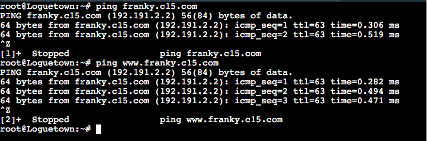
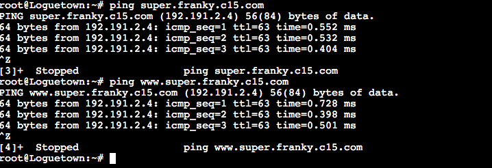
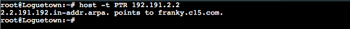
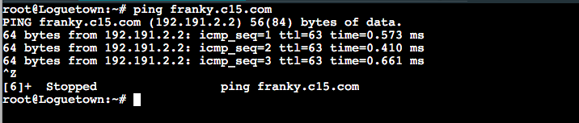
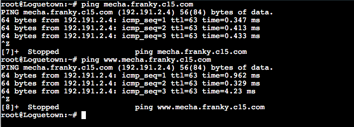
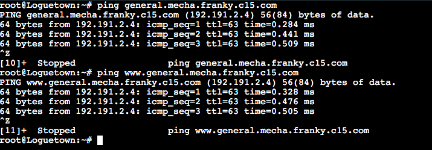

# Jarkom-Modul-2-C15-2021

# Nomor 1
Semua node terhubung pada router Foosha, sehingga dapat mengakses internet.

Langkah pengerjaan:
- Buat file `/root/script.sh` pada setiap node ubuntu
- Masukan script ini ke Foosha
  ```
  iptables -t nat -A POSTROUTING -o eth0 -j MASQUERADE -s 192.191.0.0/16
  ```
- Masukan script ini ke node lainnya
  ```
  echo nameserver 192.168.122.1 > /etc/resolv.conf
  ```
- Eksekusi setiap `script.sh` yang ada dengan urutan
  - Foosha
  - Sisanya bebas

### Hasil:


Kendala yang dialami:
- Selalu ada typo ketika menuliskan code script

# Nomor 2
Luffy ingin menghubungi Franky yang berada di EniesLobby dengan denden mushi. Kalian diminta Luffy untuk membuat website utama dengan mengakses franky.yyy.com dengan alias www.franky.yyy.com pada folder kaizoku

Langkah pengerjaan:
- Pada node EniesLobby
  - Buat folder ` /etc/bind/kaizoku`
  - Buat file `/root/dns/dblocal-domain.txt` lalu isikan seperti dibawah
    ```
    ;
    ; BIND data file for local loopback interface
    ;
    $TTL    604800
    @       IN      SOA     franky.c15.com. root.franky.c15.com. (
                            2021100401         ; Serial
                             604800         ; Refresh
                              86400         ; Retry
                            2419200         ; Expire
                             604800 )       ; Negative Cache TTL
    ;
    @       IN      NS      franky.c15.com.
    @       IN      A       192.191.2.2     ; IP EniesLobby
    www     IN      CNAME   franky.c15.com.
    ```
  - Tambahkan code ini pada `script.sh`
    ```
    apt-get update
    apt-get install bind9 -y

    domain="zone \"franky.c15.com\" {\n
        type master;\n
        file \"/etc/bind/kaizoku/franky.c15.com\";\n
    };\n"
    
    echo -e $domain > /etc/bind/named.conf.local

    cp /etc/bind/db.local /etc/bind/kaizoku/franky.c15.com
    cat ./dns/dblocal-domain.txt > /etc/bind/kaizoku/franky.c15.com
    
    service bind9 restart
    ```
  - Eksekusi file `script.sh`

- Pada node Loguetown (ini adalah node client)
  - Tambahkan code ini pada `script.sh`
    ```
    echo nameserver 192.191.2.2 >> /etc/resolv.conf
    ```
  - Eksekusi file `script.sh`

### Hasil


Kendala yang dialami:
- Selalu ada typo ketika menuliskan code script

# Nomor 3
Setelah itu buat subdomain super.franky.yyy.com dengan alias www.super.franky.yyy.com yang diatur DNS nya di EniesLobby dan mengarah ke Skypie

Langkah pengerjaan:
- Pada node EniesLobby, tambahkan baris ini di file `/root/dns/dblocal-domain.txt`
  ```
  super   IN      A       192.191.2.4     ; IP Skypie
  www.super IN    A       192.191.2.4     ; IP Skypie
  ```
- Eksekusi file `script.sh`

### Hasil


Kendala yang dialami:
- Selalu ada typo ketika menuliskan code script

# Nomor 4
Buat juga reverse domain untuk domain utama 

Langkah pengerjaan:
- Pada node EniesLobby
  - Buat file `/root/dns/dblocal-reverse-domain.txt` lalu isikan seperti dibawah
    ```
    ;
    ; BIND data file for local loopback interface
    ;
    $TTL    604800
    @       IN      SOA     franky.c15.com. root.franky.c15.com. (
                            2021100401         ; Serial
                             604800         ; Refresh
                              86400         ; Retry
                            2419200         ; Expire
                             604800 )       ; Negative Cache TTL
    ;
    2.191.192.in-addr.arpa. IN      NS      franky.c15.com.
    2                       IN      PTR     franky.c15.com. ;BYTE-4 EniesLobby
    ```
  - Tambahkan code ini pada `scirpt.sh`
    ```
    reverseDomain="zone \"2.191.192.in-addr.arpa\" {\n
        type master;\n
        file \"/etc/bind/kaizoku/2.191.192.in-addr.arpa\";\n
    };\n"

    echo -e $reverseDomain >> /etc/bind/named.conf.local
    cat ./dns/dblocal-reverse-domain.txt > /etc/bind/kaizoku/2.191.192.in-addr.arpa
    ```
  - Eksekusi `script.sh`

- Pada node Loguetown
  - Tambahkan code ini pada `script.sh`
    ```
    apt-get update
    apt-get install dnsutils -y
    echo nameserver 192.191.2.2 > /etc/resolv.conf
    ```
  - Eksekusi `script.sh`

### Hasil:


Kendala yang dialami:
- Selalu ada typo ketika menuliskan code script

# Nomor 5
Supaya tetap bisa menghubungi Franky jika server EniesLobby rusak, maka buat Water7 sebagai DNS Slave untuk domain utama

Langkah pengerjaan:
- Pada node EniesLobby
  - Modifikasi `script.sh` pada bagian berikut
    ```
    # Tambahkan variabel domainMaster seperti dibawah
    domainMaster="zone \"franky.c15.com\" {\n
        type master;\n
        notify yes;\n
        also-notify { 192.191.2.3; }; // IP Water7\n
        allow-transfer { 192.191.2.3; }; // IP Water7\n 
        file \"/etc/bind/kaizoku/franky.c15.com\";\n
    };\n"

    # Comment echo domain menjadi echo domainMaster
    # echo -e $domain > /etc/bind/named.conf.local
    echo -e $domainMaster > /etc/bind/named.conf.local
    ```
  - Eksekusi `script.sh`

- Pada node Water7
  - Tambahkan code berikut pada `script.sh`
    ```
    apt-get update
    apt-get install bind9 -y

    domainSlave="zone \"franky.c15.com\" {\n
        type slave;\n
        masters { 192.191.2.2; }; // IP EniesLobby\n
        file \"/var/lib/bind/franky.c15.com\";\n
    };\n"

    echo -e $domainSlave > /etc/bind/named.conf.local

    service bind9 restart
    ```
  - Eksekusi `script.sh`

### Hasil
- Stop terlebih dahulu server EniesLobby menggunakan command
  ```
  service bind9 stop
  ```
- Pada node Loguetown uji coba 
  ```
  ping franky.c15.com
  ```
  

Kendala yang dialami:
- Selalu ada typo ketika menuliskan code script

# Nomor 6
Setelah itu terdapat subdomain mecha.franky.yyy.com dengan alias www.mecha.franky.yyy.com yang didelegasikan dari EniesLobby ke Water7 dengan IP menuju ke Skypie dalam folder sunnygo

Langkah pengerjaan:
- Pada node EniesLobby
  - Tambahkan code berikut pada `/root/dns/dblocal-domain.txt`
    ```
    ns1     IN      A       192.191.2.3     ; IP Water7
    mecha   IN      NS      ns1
    ```
  - Buat file `/root/dns/options.txt` lalu isikan seperti berikut
    ```
    options {
        directory "/var/cache/bind";

        // If there is a firewall between you and nameservers you want
        // to talk to, you may need to fix the firewall to allow multiple
        // ports to talk.  See http://www.kb.cert.org/vuls/id/800113

        // If your ISP provided one or more IP addresses for stable 
        // nameservers, you probably want to use them as forwarders.  
        // Uncomment the following block, and insert the addresses replacing 
        // the all-0's placeholder.

        // forwarders {
        //      0.0.0.0;
        // };

        //========================================================================
        // If BIND logs error messages about the root key being expired,
        // you will need to update your keys.  See https://www.isc.org/bind-keys
        //========================================================================
        // dnssec-validation auto;
        allow-query{any;};

        auth-nxdomain no;    # conform to RFC1035
        listen-on-v6 { any; };
    };
    ```
  - Modifikasi `script.sh` pada bagian berikut
    ```
    # Tambahkan variable domainDelegasi
    domainDelegasi="zone \"franky.c15.com\" {\n
        type master;\n
        file \"/etc/bind/kaizoku/franky.c15.com\";\n
        allow-transfer { 192.191.2.3; }; // IP Water7\n 
    };\n"

    # Comment echo domainMaster menjadi echo domainDelegasi
    # echo -e $domainMaster > /etc/bind/named.conf.local
    echo -e $domainDelegasi > /etc/bind/named.conf.local

    # Tambahkan code ini
    cat ./dns/options.txt > /etc/bind/named.conf.options
    ```
  - Eksekusi `script.sh`

- Pada node Water7
  - Buat file `/root/dns/dblocal-delegasi-domain.txt`
    ```
    ;
    ; BIND data file for local loopback interface
    ;
    $TTL    604800
    @       IN      SOA     mecha.franky.c15.com. root.mecha.franky.c15.com. (
                            2021100401              ; Serial
                             604800         ; Refresh
                              86400         ; Retry
                            2419200         ; Expire
                             604800 )       ; Negative Cache TTL
    ;
    @       IN      NS      mecha.franky.c15.com.
    @       IN      A       192.191.2.4     ; IP Skypie
    www     IN      CNAME   mecha.franky.c15.com.
    ```
  - Buat file `/root/dns/options.txt` lalu isikan seperti berikut
    ```
    options {
        directory "/var/cache/bind";

        // If there is a firewall between you and nameservers you want
        // to talk to, you may need to fix the firewall to allow multiple
        // ports to talk.  See http://www.kb.cert.org/vuls/id/800113

        // If your ISP provided one or more IP addresses for stable 
        // nameservers, you probably want to use them as forwarders.  
        // Uncomment the following block, and insert the addresses replacing 
        // the all-0's placeholder.

        // forwarders {
        //      0.0.0.0;
        // };

        //========================================================================
        // If BIND logs error messages about the root key being expired,
        // you will need to update your keys.  See https://www.isc.org/bind-keys
        //========================================================================
        // dnssec-validation auto;
        allow-query{any;};


        auth-nxdomain no;    # conform to RFC1035
        listen-on-v6 { any; };
    };
    ```
  - Tambahkan code ini pada `script.sh`
    ```
    domainDelegasi="zone \"mecha.franky.c15.com\" {\n
        type master;\n
        file \"/etc/bind/sunnygo/mecha.franky.c15.com\";\n
    };\n"

    mkdir /etc/bind/sunnygo
    cat ./dns/dblocal-delegasi-domain.txt > /etc/bind/sunnygo/mecha.franky.c15.com

    echo -e $domainDelegasi >> /etc/bind/named.conf.local
    ```
  - Eksekusi `script.sh`

### Hasil


Kendala yang dialami:
- Selalu ada typo ketika menuliskan code script

# Nomor 7
Untuk memperlancar komunikasi Luffy dan rekannya, dibuatkan subdomain melalui Water7 dengan nama general.mecha.franky.yyy.com dengan alias www.general.mecha.franky.yyy.com yang mengarah ke Skypie

Langkah pengerjaan:
- Pada node Water7
  - Tambahkan code ini pada file `/root/dns/dblocal-delegasi-domain.txt`
    ```
    general IN      A       192.191.2.4     ; IP Skypie
    www.general IN  A       192.191.2.4     ; IP Skypie
    ```
  -Eksekusi `script.sh`

### Hasil


Kendala yang dialami:
- Selalu ada typo ketika menuliskan code script

<br>

## Nomor 8

Konfigurasi server yang telah dibuat pada **nomor 1-7** akan dilanjutkan dengan konfigurasi Webserver. Pertama dengan webserver `www.franky.yyy.com`. Pertama, luffy membutuhkan webserver dengan DocumentRoot pada `/var/www/franky.yyy.com`.

### Jawaban

#### Skypie

Lakukan instalasi Apache, PHP, serta libapache2-mod-php7.0.

```
apt-get install apache2 -y
apt-get install php -y
apt-get install libapache2-mod-php7.0 -y

```

Lakukan start apache pada command :

`service apache2 start`

Pindah directory ke `/etc/apache2/sites-available` dengan command :

`cd /etc/apache2/sites-available`

Kemudian, buat config website franky dengan menyalin dari template yang sudah ada :


`cp 000-default.conf franky.c15.com.conf`

Buka `conf`-nya dengan `nano franky.c15.com.conf` dan tambahkan sebagai berikut :


Aktifkan konfigurasi franky.c15.com dengan `a2ensite franky.c15.com` dan restart apache `service apache2 restart`.

Kita juga perlu download file `franky.zip` yang ada pada Github dengan `wget` sebagai berikut :

`wget https://github.com/FeinardSlim/Praktikum-Modul-2-Jarkom/raw/main/franky.zip`

Lakukan unzip dengan `unzip franky.zip` dan copy file yang ada di dalam folder `franky` setelah di unzip ke directory `/var/www/franky.c15.com`.

Periksa kembali (untuk mengecek apakah ada `home.html` & `index.php`) dengan :
`ls /var/www/franky.c15.com`

#### Loguetown

Pertama, install lynx terlebih dulu dengan `apt-get install lynx -y`.

Jika sudah, lakukan command `lynx.www.franky.c15.com` dan akan mengeluarkan output :


## Nomor 9

Setelah itu, Luffy juga membutuhkan agar url `www.franky.yyy.com/index.php/home` dapat menjadi menjadi `www.franky.yyy.com/home`. 

### Jawaban
#### Skypie

Jalankan perintah `a2enmod rewrite` untuk mengaktifkan module rewrite dan restart kembali Apache dengan `service apache2 restart`.


Terkadang, ada sebuah kasus bahwa hak akses root untuk mengedit file konfigurasi yang berada di folder `/etc/apache2/sites-available` tidak dimiliki, atau kita tidak ingin user lain untuk mengedit file konfigurasi yang berada di directory `/etc/apache2/sites-available`.


Untuk mengatasinya, kita perlu buat file `.htaccess` pada folder `/var/www/franky.c15.com` dan tambahkan seperti ini :


Kembali ke directory `/etc/apache2/sites-available` dan edit file `franky.c15.com.conf` (agar file `.htaccess` dapat berjalan) sebagai berikut :


Kembali lakukan restart apache `service apache2 restart`

#### Loguetown

Cek apakah config untuk rewrite berhasil dengan command :


`lynx www.franky.c15.com/home`

Hasilnya adalah sebagai berikut :


## Soal 10

Tidak hanya itu, Luffy juga menyiapkan error file 404.html pada folder /error untuk mengganti error kode pada apache

### Jawaban

#### Skypie

Pengerjaan nomor 10 tidak beda jauh dengan nomor 8, hanya domain (subdomain) -nya saja yang diubah menjadi `www.super.franky.yyy.com`.

Pertama, pindah ke directory /etc/apache2/sites-available dan copy file template `000-default.conf` menjadi file baru dengan command :

`cp 000-default.conf super.franky.E08.com.conf`

Tambahkan juga pada `super.franky.c15.com.conf` sebagai berikut :


Aktifkan konfigurasi dengan `a2ensite super.franky.c15.com` dan restart apache `service apache2 restart`.

Pindah dengan `cd /var/www` dan download file zip dengan command :

`wget https://github.com/FeinardSlim/Praktikum-Modul-2-Jarkom/raw/main/super.franky.zip`

Unzip dengan `unzip super.franky.zip`. Rename juga foldernya menjadi `super.franky.c15.com` yang berisi file `error` & `public`.

#### Loguetown

Lakukan `lynx www.super.franky.c15.com`, hasil output adalah :


## Soal 11

Akan tetapi, pada folder /public, Luffy ingin hanya dapat melakukan directory listing saja.

### Jawaban
#### Skypie

Kembali ke directory letak config dengan `cd /etc/apache2/sites-available`

Tambahkan pada file `super.franky.c15.com.conf` sebagai berikut :


Pada `.../public/*`, diberikan `Options -Indexes` agar mengeluarkan error apabila nanti melakukan lynx ke `.../public/...`.

Lakukan restart apache `service apache2 restart`.

#### Loguetown

Lakukan `lynx www.super.franky.c15.com/public`, hasil output adalah :

 
 
 Kemudian, di bawah ini adalah output jika mengakses `.../public/css`, `.../public/images`, dan `.../public/js` menggunakan lynx.
 


## Soal 12
Tidak hanya itu, Luffy juga menyiapkan error file `404.html` pada folder `/error` untuk mengganti error kode pada apache.

### Jawaban
#### Skypie

Kembali ke directory letak config dengan `cd /etc/apache2/sites-available`.

Tambahkan `Error Document` pada file `super.franky.c15.com.conf` sebagai berikut :


Lakukan restart apache `service apache2 restart`.

#### Loguetown

Lakukan `lynx www.super.franky.c15.com/publiccc` (disengaja adanya typo), hasil output adalah :


## Soal 13
Luffy juga meminta Nami untuk dibuatkan konfigurasi virtual host. Virtual host ini bertujuan untuk dapat mengakses file asset `www.super.franky.yyy.com/public/js` menjadi `www.super.franky.yyy.com/js`. 

### Jawaban
#### Skypie

Kembali ke directory letak config dengan `cd /etc/apache2/sites-available`.

Tambahkan `Alias untuk js` pada file `super.franky.c15.com.conf` sebagai berikut :


Lakukan restart apache `service apache2 restart`.

#### Loguetown

Lakukan `lynx www.super.franky.c15.com/js`, hasil output adalah :


<br>

# Nomor 14
Luffy meminta agar ```www.general.mecha.franky.c15.com``` agar hanya dapat diakses oleh port ```15000``` dan ```15500```

Langkah pengerjaan:
- Pada node Skypie
  - pilih direktori ```/etc/apache2/sites-available```
  - copy file ```000-default.conf``` dan ubah nama file menjadi ```general.mecha.franky.c15.com.conf```
  - ubah port menjadi 15000 dan 15500
  - 

  - kemudian pada direktori ```/etc/apache/``` dan ubah pada file ```ports.conf```
  - 
  - ubah port yang di listen seperti gambar diatas
  - kemudian aktifkan konfigurasi dengan ```a2ensite general.mecha.franky.c15.com.conf```
  - setelah konfigurasi diaktifkan restart apache ```service apache2 restart```

  - pindah direktori ke ```/var/www```
  - download file yang telah disediakan dengan command ```wget https://github.com/FeinardSlim/Praktikum-Modul-2-Jarkom/raw/main/general.mecha.franky.zip```
  - unzip file ```unzip general.mecha.franky.c15.com```
  - kemudian hasil dari file zip yang telah di unzip tersebut di rename menjadi ```general.mecha.franky.c15.com``` menggunakan command ```mv general.mecha.franky general.mecha.franky.c15.com```

 ### Hasil
 - Testing pada Node Loguetown
  - ```lynx general.mecha.c15.com:15000```
  - 

<br>

# Nomor 15
memberi autentikasi pada file ```/var/www/general.mecha.franky.c15.com```

Langkah pengerjaan:
- Node Skypie
  - edit file pada ```/etc/apache2/sites-available/general.mecha.franky.c15.com``` seperti gambar diabawah ini
  - 

  - Kemudian jalankan command ```htpasswd -c /etc/apache2/.htpasswd luffy``` dan isikan password ```onepiece```
  - restart apache ```service apache2 restart```

### Hasil 
- Testing pada Node Loguetown
- jalankan command ```lynx www.general.mecha.franky.c15.com:15000```
- 
- muncul interface sebagai berikut dan isikan username dengan ```luffy```
- 
- dan isikan password tersebut dengan ```onepiece```
- 

Kendala yang dialami:
- Penerapan directory listing
- pada ```htpasswd```

<br>

# Nomer 16
Ketika mengakses IP Skypie maka akan dialihkan ke www.franky.c15.com

Langkah pengerjaan :
- pada node Skypie
  - Edit file ``` nano /etc/apache2/sites-available/000-default.conf``` menjadi seperti berikut
  - 
  - service apache2 restart

### Hasil 
- Testing pada node Loguetown:
    - akses IP Skypie dengan command ```192.191.2.4```
    - maka akan dialihkan ke ```www.franky.c15.com```
    - 
Kendala yang dialami:
 -


