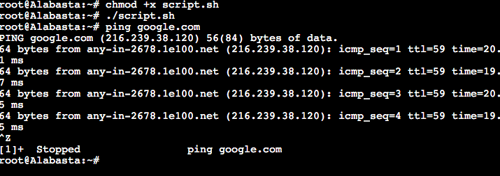

# Jarkom-Modul-2-C15-2021

<br>

# Nomor 1
Semua node terhubung pada router Foosha, sehingga dapat mengakses internet.

Langkah pengerjaan:
- Buat file `/root/script.sh` pada setiap node ubuntu
- Masukan script ini ke Foosha
  ```
  iptables -t nat -A POSTROUTING -o eth0 -j MASQUERADE -s 192.191.0.0/16
  ```
- Masukan script ini ke node lainnya
  ```
  echo nameserver 192.168.122.1 > /etc/resolv.conf
  ```
- Eksekusi setiap `script.sh` yang ada dengan urutan
  - Foosha
  - Sisanya bebas

### Hasil:


Kendala yang dialami:
- Selalu ada typo ketika menuliskan code script

# Nomor 2
Luffy ingin menghubungi Franky yang berada di EniesLobby dengan denden mushi. Kalian diminta Luffy untuk membuat website utama dengan mengakses franky.yyy.com dengan alias www.franky.yyy.com pada folder kaizoku

Langkah pengerjaan:
- Pada node EniesLobby
  - Buat folder ` /etc/bind/kaizoku`
  - Buat file `/root/dns/dblocal-domain.txt` lalu isikan seperti dibawah
    ```
    ;
    ; BIND data file for local loopback interface
    ;
    $TTL    604800
    @       IN      SOA     franky.c15.com. root.franky.c15.com. (
                            2021100401         ; Serial
                             604800         ; Refresh
                              86400         ; Retry
                            2419200         ; Expire
                             604800 )       ; Negative Cache TTL
    ;
    @       IN      NS      franky.c15.com.
    @       IN      A       192.191.2.2     ; IP EniesLobby
    www     IN      CNAME   franky.c15.com.
    ```
  - Tambahkan code ini pada `script.sh`
    ```
    apt-get update
    apt-get install bind9 -y

    domain="zone \"franky.c15.com\" {\n
        type master;\n
        file \"/etc/bind/kaizoku/franky.c15.com\";\n
    };\n"
    
    echo -e $domain > /etc/bind/named.conf.local

    cp /etc/bind/db.local /etc/bind/kaizoku/franky.c15.com
    cat ./dns/dblocal-domain.txt > /etc/bind/kaizoku/franky.c15.com
    
    service bind9 restart
    ```
  - Eksekusi file `script.sh`

- Pada node Loguetown (ini adalah node client)
  - Tambahkan code ini pada `script.sh`
    ```
    echo nameserver 192.191.2.2 >> /etc/resolv.conf
    ```
  - Eksekusi file `script.sh`

### Hasil


Kendala yang dialami:
- Selalu ada typo ketika menuliskan code script

# Nomor 3
Setelah itu buat subdomain super.franky.yyy.com dengan alias www.super.franky.yyy.com yang diatur DNS nya di EniesLobby dan mengarah ke Skypie

Langkah pengerjaan:
- Pada node EniesLobby, tambahkan baris ini di file `/root/dns/dblocal-domain.txt`
  ```
  super   IN      A       192.191.2.4     ; IP Skypie
  www.super IN    A       192.191.2.4     ; IP Skypie
  ```
- Eksekusi file `script.sh`

### Hasil


Kendala yang dialami:
- Selalu ada typo ketika menuliskan code script

# Nomor 4
Buat juga reverse domain untuk domain utama 

Langkah pengerjaan:
- Pada node EniesLobby
  - Buat file `/root/dns/dblocal-reverse-domain.txt` lalu isikan seperti dibawah
    ```
    ;
    ; BIND data file for local loopback interface
    ;
    $TTL    604800
    @       IN      SOA     franky.c15.com. root.franky.c15.com. (
                            2021100401         ; Serial
                             604800         ; Refresh
                              86400         ; Retry
                            2419200         ; Expire
                             604800 )       ; Negative Cache TTL
    ;
    2.191.192.in-addr.arpa. IN      NS      franky.c15.com.
    2                       IN      PTR     franky.c15.com. ;BYTE-4 EniesLobby
    ```
  - Tambahkan code ini pada `scirpt.sh`
    ```
    reverseDomain="zone \"2.191.192.in-addr.arpa\" {\n
        type master;\n
        file \"/etc/bind/kaizoku/2.191.192.in-addr.arpa\";\n
    };\n"

    echo -e $reverseDomain >> /etc/bind/named.conf.local
    cat ./dns/dblocal-reverse-domain.txt > /etc/bind/kaizoku/2.191.192.in-addr.arpa
    ```
  - Eksekusi `script.sh`

- Pada node Loguetown
  - Tambahkan code ini pada `script.sh`
    ```
    apt-get update
    apt-get install dnsutils -y
    echo nameserver 192.191.2.2 > /etc/resolv.conf
    ```
  - Eksekusi `script.sh`

### Hasil:


Kendala yang dialami:
- Selalu ada typo ketika menuliskan code script

# Nomor 5
Supaya tetap bisa menghubungi Franky jika server EniesLobby rusak, maka buat Water7 sebagai DNS Slave untuk domain utama

Langkah pengerjaan:
- Pada node EniesLobby
  - Modifikasi `script.sh` pada bagian berikut
    ```
    # Tambahkan variabel domainMaster seperti dibawah
    domainMaster="zone \"franky.c15.com\" {\n
        type master;\n
        notify yes;\n
        also-notify { 192.191.2.3; }; // IP Water7\n
        allow-transfer { 192.191.2.3; }; // IP Water7\n 
        file \"/etc/bind/kaizoku/franky.c15.com\";\n
    };\n"

    # Comment echo domain menjadi echo domainMaster
    # echo -e $domain > /etc/bind/named.conf.local
    echo -e $domainMaster > /etc/bind/named.conf.local
    ```
  - Eksekusi `script.sh`

- Pada node Water7
  - Tambahkan code berikut pada `script.sh`
    ```
    apt-get update
    apt-get install bind9 -y

    domainSlave="zone \"franky.c15.com\" {\n
        type slave;\n
        masters { 192.191.2.2; }; // IP EniesLobby\n
        file \"/var/lib/bind/franky.c15.com\";\n
    };\n"

    echo -e $domainSlave > /etc/bind/named.conf.local

    service bind9 restart
    ```
  - Eksekusi `script.sh`

### Hasil
- Stop terlebih dahulu server EniesLobby menggunakan command
  ```
  service bind9 stop
  ```
- Pada node Loguetown uji coba 
  ```
  ping franky.c15.com
  ```
  

Kendala yang dialami:
- Selalu ada typo ketika menuliskan code script

# Nomor 6
Setelah itu terdapat subdomain mecha.franky.yyy.com dengan alias www.mecha.franky.yyy.com yang didelegasikan dari EniesLobby ke Water7 dengan IP menuju ke Skypie dalam folder sunnygo

Langkah pengerjaan:
- Pada node EniesLobby
  - Tambahkan code berikut pada `/root/dns/dblocal-domain.txt`
    ```
    ns1     IN      A       192.191.2.3     ; IP Water7
    mecha   IN      NS      ns1
    ```
  - Buat file `/root/dns/options.txt` lalu isikan seperti berikut
    ```
    options {
        directory "/var/cache/bind";

        // If there is a firewall between you and nameservers you want
        // to talk to, you may need to fix the firewall to allow multiple
        // ports to talk.  See http://www.kb.cert.org/vuls/id/800113

        // If your ISP provided one or more IP addresses for stable 
        // nameservers, you probably want to use them as forwarders.  
        // Uncomment the following block, and insert the addresses replacing 
        // the all-0's placeholder.

        // forwarders {
        //      0.0.0.0;
        // };

        //========================================================================
        // If BIND logs error messages about the root key being expired,
        // you will need to update your keys.  See https://www.isc.org/bind-keys
        //========================================================================
        // dnssec-validation auto;
        allow-query{any;};

        auth-nxdomain no;    # conform to RFC1035
        listen-on-v6 { any; };
    };
    ```
  - Modifikasi `script.sh` pada bagian berikut
    ```
    # Tambahkan variable domainDelegasi
    domainDelegasi="zone \"franky.c15.com\" {\n
        type master;\n
        file \"/etc/bind/kaizoku/franky.c15.com\";\n
        allow-transfer { 192.191.2.3; }; // IP Water7\n 
    };\n"

    # Comment echo domainMaster menjadi echo domainDelegasi
    # echo -e $domainMaster > /etc/bind/named.conf.local
    echo -e $domainDelegasi > /etc/bind/named.conf.local

    # Tambahkan code ini
    cat ./dns/options.txt > /etc/bind/named.conf.options
    ```
  - Eksekusi `script.sh`

- Pada node Water7
  - Buat file `/root/dns/dblocal-delegasi-domain.txt`
    ```
    ;
    ; BIND data file for local loopback interface
    ;
    $TTL    604800
    @       IN      SOA     mecha.franky.c15.com. root.mecha.franky.c15.com. (
                            2021100401              ; Serial
                             604800         ; Refresh
                              86400         ; Retry
                            2419200         ; Expire
                             604800 )       ; Negative Cache TTL
    ;
    @       IN      NS      mecha.franky.c15.com.
    @       IN      A       192.191.2.4     ; IP Skypie
    www     IN      CNAME   mecha.franky.c15.com.
    ```
  - Buat file `/root/dns/options.txt` lalu isikan seperti berikut
    ```
    options {
        directory "/var/cache/bind";

        // If there is a firewall between you and nameservers you want
        // to talk to, you may need to fix the firewall to allow multiple
        // ports to talk.  See http://www.kb.cert.org/vuls/id/800113

        // If your ISP provided one or more IP addresses for stable 
        // nameservers, you probably want to use them as forwarders.  
        // Uncomment the following block, and insert the addresses replacing 
        // the all-0's placeholder.

        // forwarders {
        //      0.0.0.0;
        // };

        //========================================================================
        // If BIND logs error messages about the root key being expired,
        // you will need to update your keys.  See https://www.isc.org/bind-keys
        //========================================================================
        // dnssec-validation auto;
        allow-query{any;};


        auth-nxdomain no;    # conform to RFC1035
        listen-on-v6 { any; };
    };
    ```
  - Tambahkan code ini pada `script.sh`
    ```
    domainDelegasi="zone \"mecha.franky.c15.com\" {\n
        type master;\n
        file \"/etc/bind/sunnygo/mecha.franky.c15.com\";\n
    };\n"

    mkdir /etc/bind/sunnygo
    cat ./dns/dblocal-delegasi-domain.txt > /etc/bind/sunnygo/mecha.franky.c15.com

    echo -e $domainDelegasi >> /etc/bind/named.conf.local
    ```
  - Eksekusi `script.sh`

### Hasil


Kendala yang dialami:
- Selalu ada typo ketika menuliskan code script

# Nomor 7
Untuk memperlancar komunikasi Luffy dan rekannya, dibuatkan subdomain melalui Water7 dengan nama general.mecha.franky.yyy.com dengan alias www.general.mecha.franky.yyy.com yang mengarah ke Skypie

Langkah pengerjaan:
- Pada node Water7
  - Tambahkan code ini pada file `/root/dns/dblocal-delegasi-domain.txt`
    ```
    general IN      A       192.191.2.4     ; IP Skypie
    www.general IN  A       192.191.2.4     ; IP Skypie
    ```
  -Eksekusi `script.sh`

### Hasil


Kendala yang dialami:
- Selalu ada typo ketika menuliskan code script

<br>

# Nomor 14
Luffy meminta agar ```www.general.mecha.franky.c15.com``` agar hanya dapat diakses oleh port ```15000``` dan ```15500```

Langkah pengerjaan:
-Pada node Skypie
  - pilih direktori ```/etc/apache2/sites-available```
  - copy file ```000-default.conf``` dan ubah nama file menjadi ```general.mecha.franky.c15.com.conf```
  - ubah port menjadi 15000 dan 15500
  - 
  
  - kemudian pada direktori ```/etc/apache/``` dan ubah pada file ```ports.conf```
  - 
  - ubah port yang di listen seperti gambar diatas
  - kemudian aktifkan konfigurasi dengan ```a2ensite general.mecha.franky.c15.com.conf```
  - setelah konfigurasi diaktifkan restart apache ```service apache2 restart```

  - pindah direktori ke ```/var/www```
  - download file yang telah disediakan dengan command ```wget https://github.com/FeinardSlim/Praktikum-Modul-2-Jarkom/raw/main/general.mecha.franky.zip```
  - unzip file ```unzip general.mecha.franky.c15.com```
  - kemudian hasil dari file zip yang telah di unzip tersebut di rename menjadi ```general.mecha.franky.c15.com``` menggunakan command ```mv general.mecha.franky general.mecha.franky.c15.com```
 
 ### Hasil
 - Testing pada Node Loguetown
  - ```lynx general.mecha.c15.com:15000```
  - 

<br>

# Nomor 15
memberi autentikasi pada file ```/var/www/general.mecha.franky.c15.com```

Langkah pengerjaan:
- Node Skypie
 - edit file pada ```/etc/apache2/sites-available/general.mecha.franky.c15.com``` seperti gambar diabawah ini
 - 

 - Kemudian jalankan command ```htpasswd -c /etc/apache2/.htpasswd luffy``` dan isikan password ```onepiece```
 - restart apache ```service apache2 restart```

### Hasil 
- Testing pada Node Loguetown
- jalankan command ```lynx www.general.mecha.franky.c15.com:15000```
- 
- muncul interface sebagai berikut dan isikan username dengan ```luffy```
- 
- dan isikan password tersebut dengan ```onepiece```
- 

Kendala yang dialami:
- Penerapan directory listing
- pada ```htpasswd```

<br>

# Soal 17
Ketika mengakses IP Skypie maka akan dialihkan ke www.franky.c15.com

Langkah pengerjaan :
- pada node Skypie
  - Edit file ``` nano /etc/apache2/sites-available/000-default.conf``` menjadi seperti berikut
  - 
  - service apache2 restart

### Hasil 
- Testing pada node Loguetown:
    - akses IP Skypie dengan command ```192.191.2.4```
    - maka akan dialihkan ke ```www.franky.c15.com```
    - 

Kendala yang dialami:
-


